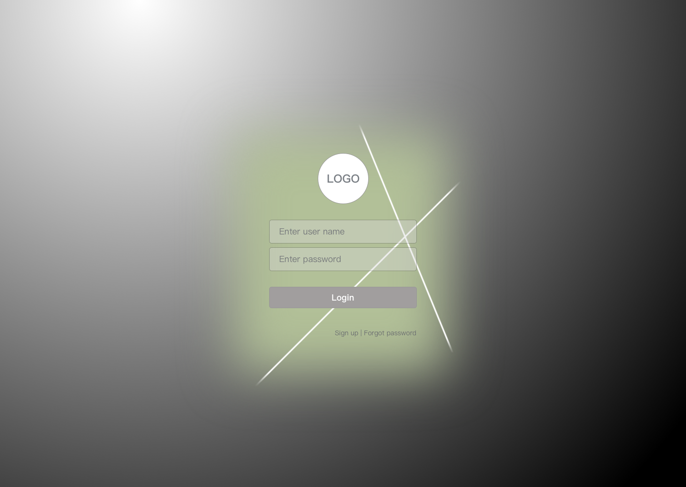

English | [简体中文](./README-ch.md)

## Rechat
An online chatting app using React. This is a practice project for learning React.js, Node.js, and more. 

### Address
[GitHub](https://github.com/ProgrammableEric/rechat)

### Demo with screenshot
##### Log in / Sign up

##### Private Chat

### Features 
- UI 
  - [x] Sign in sign up page
  - [x] left-half chat window
  - [x] right-half chat window
  - [x] Responsive layout
- Account system
  - [ ] Log in
  - [ ] Resister
  - [ ] Log out
- Chat 
  - [ ] Private chat 
  - [ ] group chat
  - [ ] adding emoji 
  - [ ] file sharing 
- Search 
  - [ ] Contact search 
  - [ ] Group search 
  - [ ] chat history search
- More 
  ... 
  

### Author 
- Jianzhen Long - [GitHub](https://github.com/Olivia-long94)
- Eric Fu - [GitHub](https://github.com/ProgrammableEric)

### Acknowledgement 
- [ghChat](https://github.com/aermin/ghChat) for project idea and project structure. 
- [Wechat web](https://web.wechat.com/) for UI design inspiration. 
